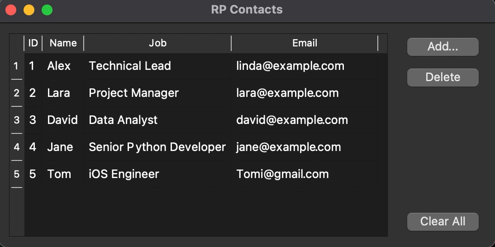

# Contact Book

## Description
A functional contact book application that allows you to store and manage your contact information. 

## Technologies Used
- Python3 
- PyQt
- SQLite

## Installation and Dependencies
```bash
# Install PyQt5 in newly created virtual environment
$ python3 -m venv pyqtvenv
$ source pyqtvenv/bin/activate
(pyqtvenv) $ pip install pyqt5
```
```bash
# Run program
python3 rpcontacts.py
```
## Demo


## Future Implementations
<ol>
<li>Ability to add new data fields to store more information about contacts photo, phone number, and web page</li>
<li>Provide a way to do a search for contact</li>
<li>Add back-up to a cloud-service or to an external disk</li>
</ol>
